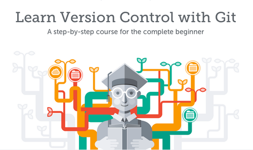

# **Course Overview**
   

## **Why Learn Git?**
Ever have an “I lost all my work and I have a deadline the next day” moment? Git is the most popular version control tool—something that developers use to save all relevant versions of their work to avoid moments like those. Git also makes it easy for developers to collaborate and share work with others!

## **Take-Away Skills:**
Git, simply put, is a tool to save versions of your code. This course will teach you a basic workflow and Git’s core features, different ways to undo changes or save multiple versions of a project, and how to collaborate with other developers.

## **WHAT YOU'LL LEARN**

### Basic Git Workflow
   An introduction to Git and a few of its core features

### How to Backtrack in Git
   Learn different ways to undo changes made to a Git project and when to use them

### Git Branching
   Learn how to manage multiple versions of a project with branching

### Git Teamwork
   An introduction to Git collaborations with remotes, pulling and pushing
  
***
 
 [**Return to Readme**](../README.md)
      